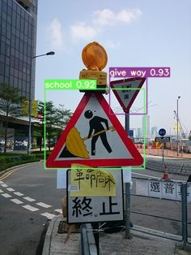
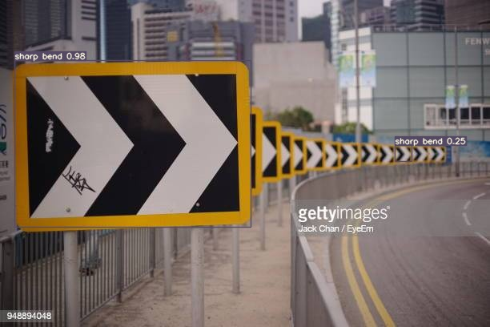
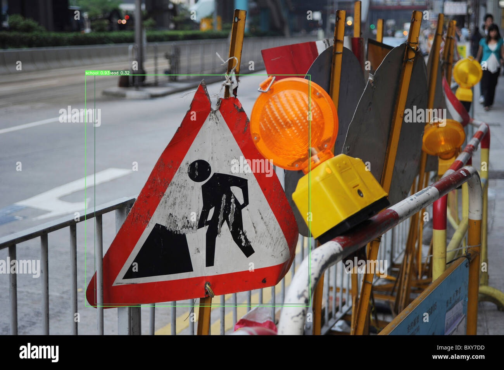
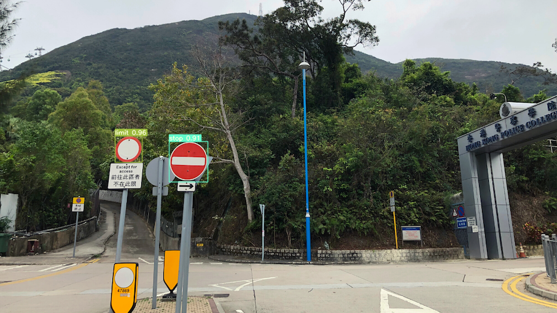
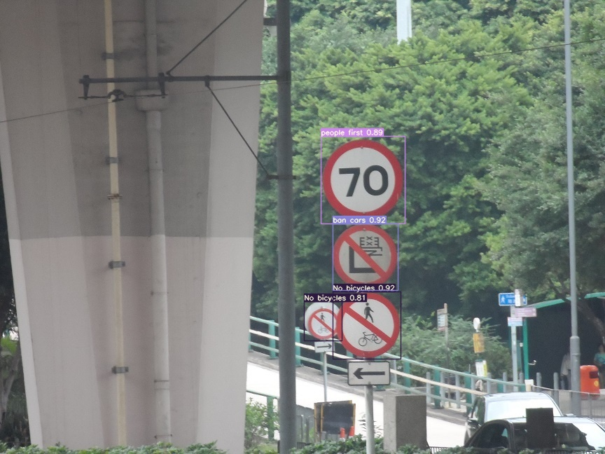

ITP4514 py yolov7 AI Project
===
路牌圖像識別

# 效果

---

# 標籤解釋

| 標籤                 | 解釋        | 例子  |
|--------------------|-----------|-----|
| 100m               | 距離目標有100米 |     |
| 200m               | 距離目標有200米 |     |
| 300m               | 距離目標有300米 |     |
| Ban on learning    | 不准學牌進入    |     |
| Inclined road      | 斜路        |     |
| MTR                | 地鐵站       |     |
| No bicycles        | 不准單車進入    |     |
| No parking (棄用)    | 不准泊車      |     |
| No passing         | 不准超車      |     |
| Notice             | 前方有其他危險   |     |
| One Way            | 單程路       |     |
| Weight limit       | 限重        |     |
| Work ahead         | 前方有工程     |     |
| ban cars           | 不准汽車進入    |     |
| ban for people     | 不准行人進入    |     |
| ban sound          | 不准響安      |     |
| bicycle            | 單車路       |     |
| black dot          | 交通黑點      |     |
| cam                | 快相機       |     |
| end of the road    | 前方道路盡頭    |     |
| give way           | 讓路        |     |
| go ahead           | 前進        |     |
| high limit         | 限高        |     |
| highway            | 快速道路      |     |
| highway end        | 快速道路終止    |     |
| landslide          | 前方山泥傾瀉    |     |
| length limit       | 限長        |     |
| limit              | 其他限制      |     |
| limited width      | 限闊        |     |
| no U-turn          | 不准掉頭      |     |
| no stop (棄用)       | 不准停車      |     |
| no turn right/left | 不准 左轉/右轉  |     |
| not enter          | 不准進入      |     |
| parking (棄用)       | 泊車        |     |
| people first       | 行人優先      |     |
| road fork          | 道路分叉      |     |
| road merge         | 道路合併      |     |
| roundabout         | 迴旋處       |     |
| school             | 校區        |     |
| sharp bend         | 急彎        |     |
| sharp bend ahead   | 前方急彎      |     |
| slippery road      | 道路濕滑      |     |
| slow               | 慢駛        |     |
| speed limit        | 限速        |     |
| stay right/left    | 靠 左/右     |     |
| stop               | 停車        |     |
| traffic light      | 前方有交通燈    |     |
| tunnel             | 隧道        |     |
| turn ahead         | 前方轉彎      |     |
| turn right/left    | 轉 左/右     |     |
| uneven road        | 凹凸路面/路面不平 |     |
